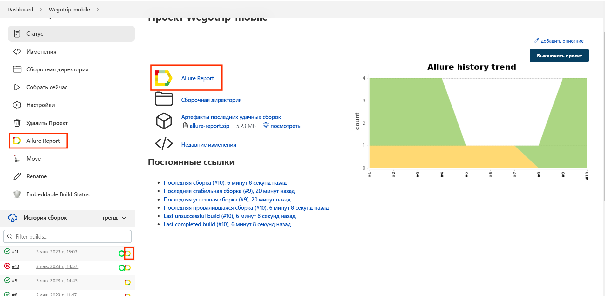
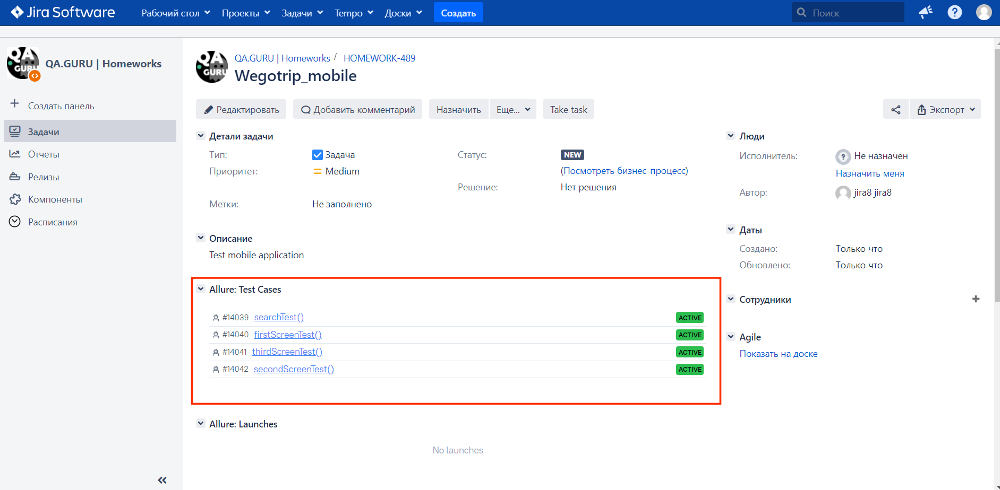

# Test automation project (mobile application) for service WeGoTrip


> WeGoTrip is the best travel app with audio guide to pass
> self guided walking tours and to buy tickets to museums of the world
> with personal skip the line or fast-track access.

## :page_with_curl:	Table of contents

> :heavy_check_mark: [Tools and technologies](#Technologist-Tools-and-technologies)
>
> :heavy_check_mark: [Implemented checks](#bookmark_tabs-Implemented-checks)
>
> :heavy_check_mark: [Running tests from the terminal](#-Running-tests-from-the-terminal)
>
> :heavy_check_mark: [Run tests in Jenkins](#-Run-tests-in-Jenkins)
>
> :heavy_check_mark: [Test results report in Allure Report](#-Test-result-report-in-Allure-Report)
> 
> :heavy_check_mark: [Integration with Allure TestOps](#-Integration-with-Allure-TestOps)
> 
> :heavy_check_mark: [Integration with Jira](#-Integration-with-Jira)
>
> :heavy_check_mark: [Notifications in Telegram using bot](#-Notifications-in-Telegram-using-bot)
>
> :heavy_check_mark: [Example of running test in Selenoid](#-Example-of-running-test-in-Selenoid)

## :technologist: Tools and technologies

<p  align="center"

<code></code>
<code></code>
<code></code>
<code></code>
<code></code>
<code></code>
<code></code>
<code></code>
<code></code>
<code></code>
<code></code>
<code></code>
<code></code>
</p>

> *In this project, autotests are written in <code><strong>*Java*</strong></code> using the <code><strong>*Selenide*</strong></code> framework for UI tests.*
>
>*<code><strong>*Gradle*</strong></code> is used to build the project.*
>
>*<code><strong>*JUnit 5*</strong></code> is used as a framework for unit testing.*
>
>*The tests are run from <code><strong>*Jenkins*</strong></code>.*
>
>*<code><strong>*BrowserStack*</strong></code> provides developers instant access to a cloud platform that allows them to comprehensively test their websites and mobile applications on 2,500+ real devices and browsers.*
>
>*<code><strong>*Allure Report, Allure TestOps, Jira, Telegram Bot*</strong></code> are used to visualize test results.*


## :bookmark_tabs: Implemented checks

### &nbsp;&nbsp;&nbsp;&nbsp;&nbsp;&nbsp; UI

> - [x] *Checking the search operation*
>- [x] *Checking the display of the first onboarding pag*
>- [x] *Checking the display of the second onboarding page*
>- [x] *Checking the display of the third onboarding page"*


## :computer: Running tests from the terminal 

### Local tests run

```bash
gradle clean test
```


##  Run tests in [Jenkins](https://jenkins.autotests.cloud/job/AUTO-638/)

*To start the build, you need to specify the parameter values and click <code><strong>*Build*</strong></code>.*

<p align="center">
  
</p>

*After the assembly is completed, an icon will appear in the <code><strong>*Build History*</strong></code> block next to the assembly number
<code><strong>*Allure
Report*</strong></code>, clicking on which will open a page with a generated html report.*

<p align="center">
  
</p>

##  Test results report in [Allure Report](https://jenkins.autotests.cloud/job/AUTO-638/8/allure/)

### :pushpin: General information

*The main page of the Allure report contains the following information blocks:*

> - [x] <code><strong>*ALLURE REPORT*</strong></code> - displays the date and time of passing the test, the total number of cases run, as well as a diagram indicating the percentage and number of successful, dropped and broken during the execution of tests
>- [x] <code><strong>*TREND*</strong></code> - displays the trend of passing tests from build to build
>- [x] <code><strong>*SUITES*</strong></code> - displays the distribution of test results by test sets
>- [x] <code><strong>*ENVIRONMENT*</strong></code> - displays the text environment on which the tests were run (in this case, the information is not specified)
>- [x] <code><strong>*CATEGORIES*</strong></code> - displays the text environment on which the tests were run (in this case, the information is not specified)
>- [x] <code><strong>*FEATURES BY STORIES*</strong></code> - displays the distribution of tests by the functionality they are checking
>- [x] <code><strong>*EXECUTORS*</strong></code> - displays the executor of the current build

<p align="center">
  
</p>

##  Integration with [Allure TestOps](https://allure.autotests.cloud/launch/10145)

### :pushpin: The main dashboard

<p align="center">
  
</p>

### :pushpin: Test cases

<p align="center">
  
</p>

##  Integration with [Jira](https://jira.autotests.cloud/browse/AUTO-638)

<p align="center">
  
</p>

##  Notifications in Telegram using bot

> After the assembly is completed, a special bot created in <code>Telegram</code> automatically processes and sends a message with a report on the test run.

<p align="center">

</p>

##  Example of running test in Selenoid

> Video is attached to each test in the report.
<p align="center">
  
</p>

